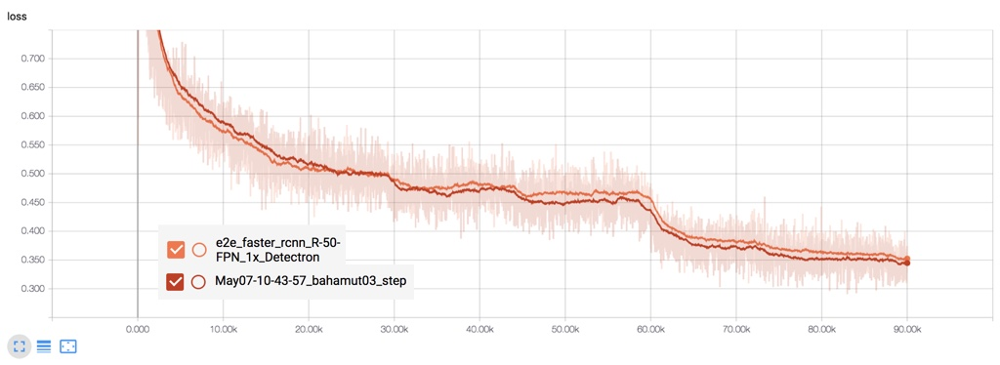
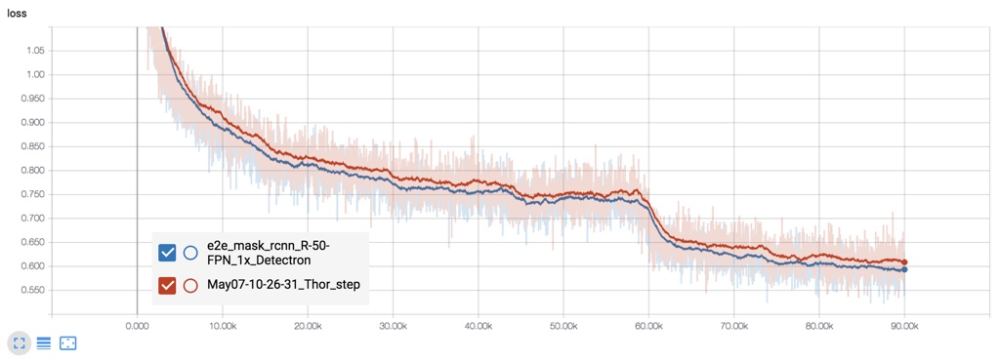
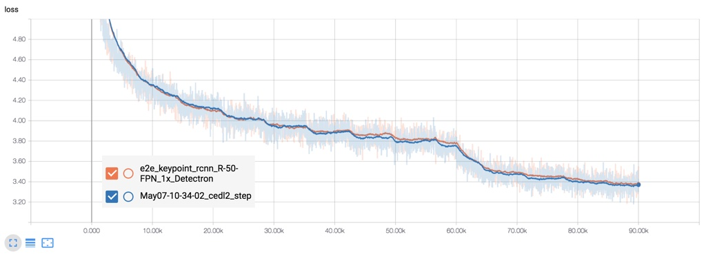

# Benchmark results

## Introductoin

- Benchmark results using the weights from [Detectron model zoo]() are basically the same. Hence, I won't list them here.
- All the testing results below are on COCO2017 val-set, using the models trained from scratch on COCO2017 train-set.
- Evaluation scores are rounded to 3 decimal places and presented in the format of percentage.
- Multiple evaluation on using pytorch may be listed. Each represents different training trial with same settings.

### COCO evaluation metrics

<table><tbody>
<tr><th colspan="2" bgcolor=#f8f8f8>Average Precision</th></tr>
<tr><th align="left" bgcolor=#f8f8f8>AP50:95</th><td bgcolor=white> AP at IoU=0.50:0.05:0.95</td></tr>
<tr><th align="left" bgcolor=#f8f8f8>AP50</th><td bgcolor=white> AP at IoU=0.50</td></tr>
<tr><th align="left" bgcolor=#f8f8f8>AP75</th><td bgcolor=white> AP at IoU=0.75</td></tr>
<tr><th align="left" bgcolor=#f8f8f8>APs</th><td bgcolor=white> AP for small objects: area < 32<sup>2</sup></td></tr>
<tr><th align="left" bgcolor=#f8f8f8>APm</th><td bgcolor=white> AP for medium objects: 32<sup>2</sup> < area < 96<sup>2</sup></td></tr>
<tr><th align="left" bgcolor=#f8f8f8>APl</th><td bgcolor=white> AP for large objects: area > 96<sup>2</sup></sup></td></tr>
</table></tbody>

<table><tbody>
<tr><th colspan="2" bgcolor=#f8f8f8>Average Recall</th></tr>
<tr><th align="left" bgcolor=#f8f8f8>AR1</th><td bgcolor=white> AR given 1 detection per image</td></tr>
<tr><th align="left" bgcolor=#f8f8f8>AR10</th><td bgcolor=white> AR given 10 detection per image</td></tr>
<tr><th align="left" bgcolor=#f8f8f8>AR100</th><td bgcolor=white> AR given 100 detection per image</td></tr>
<tr><th align="left" bgcolor=#f8f8f8>ARs</th><td bgcolor=white> AR for small objects: area < 32<sup>2</sup></td></tr>
<tr><th align="left" bgcolor=#f8f8f8>ARm</th><td bgcolor=white> AR for medium objects: 32<sup>2</sup> < area < 96<sup>2</sup></td></tr>
<tr><th align="left" bgcolor=#f8f8f8>ARl</th><td bgcolor=white> AR for large objects: area > 96<sup>2</sup></sup></td></tr>
</table></tbody>

## Faster-RCNN
### e2e_faster_rcnn-R-50-FPN_1x

- Training command:

  ```
  python tools/train_net_step.py \
    --dataset coco2017 --cfg configs/e2e_faster_rcnn_R-50-FPN_1x.yaml \
    --bs 8 --iter_size 2 --use_tfboard
  ```
  on two 1080ti GPUs.

<table><tbody>
<tr><th colspan="13" bgcolor=#f8f8f8>Box</th></tr>
<tr>
<th>source</th>
<th>AP50:95</th>
<th>AP50</th>
<th>AP75</th>
<th>APs</th>
<th>APm</th>
<th>APl</th>
<th>AR1</th>
<th>AR10</th>
<th>AR100</th>
<th>ARs</th>
<th>ARm</th>
<th>ARl</th>
</tr>
<tr>
<th bgcolor=white>PyTorch</th>
<td align="right" bgcolor=white>37.1</td>
<td align="right" bgcolor=white>59.1</td>
<td align="right" bgcolor=white>40.0</td>
<td align="right" bgcolor=white>21.5</td>
<td align="right" bgcolor=white>39.8</td>
<td align="right" bgcolor=white>48.3</td>
<td align="right" bgcolor=white>30.8</td>
<td align="right" bgcolor=white>48.0</td>
<td align="right" bgcolor=white>50.3</td>
<td align="right" bgcolor=white>31.4</td>
<td align="right" bgcolor=white>53.9</td>
<td align="right" bgcolor=white>63.6</td>
</tr>
<tr>
<th bgcolor=white>Detectron</th>
<td align="right", bgcolor=white>36.7</td>
<td align="right", bgcolor=white>58.4</td>
<td align="right", bgcolor=white>39.6</td>
<td align="right", bgcolor=white>21.1</td>
<td align="right", bgcolor=white>39.8</td>
<td align="right", bgcolor=white>48.1</td>
<td align="right", bgcolor=white>30.6</td>
<td align="right", bgcolor=white>48.0</td>
<td align="right", bgcolor=white>50.4</td>
<td align="right", bgcolor=white>31.8</td>
<td align="right", bgcolor=white>54.1</td>
<td align="right", bgcolor=white>63.4</td>
</tr>
</table></tbody>

- Total loss comparison:

  

## Mask-RCNN

- Training command:

  ```
  python train_net_step.py \
    --dataset coco2017 --cfg configs/e2e_mask_rcnn_R-50-FPN_1x.yml --use_tfboard
  ```
  on four M40 GPUs.

<table><tbody>
<tr><th colspan="13" bgcolor=#f8f8f8>Box</th></tr>
<tr>
<th>source</th>
<th>AP50:95</th>
<th>AP50</th>
<th>AP75</th>
<th>APs</th>
<th>APm</th>
<th>APl</th>
<th>AR1</th>
<th>AR10</th>
<th>AR100</th>
<th>ARs</th>
<th>ARm</th>
<th>ARl</th>
</tr>
<tr>
<th bgcolor=white>PyTorch</th>
<td align="right" bgcolor=white>37.7</td>
<td align="right" bgcolor=white>59.1</td>
<td align="right" bgcolor=white>41.0</td>
<td align="right" bgcolor=white>21.5</td>
<td align="right" bgcolor=white>40.7</td>
<td align="right" bgcolor=white>49.6</td>
<td align="right" bgcolor=white>31.3</td>
<td align="right" bgcolor=white>48.7</td>
<td align="right" bgcolor=white>51.1</td>
<td align="right" bgcolor=white>32.7</td>
<td align="right" bgcolor=white>54.4</td>
<td align="right" bgcolor=white>64.9</td>
</tr>
<tr>
<th bgcolor=white>PyTorch</th>
<td align="right" bgcolor=white>37.6</td>
<td align="right" bgcolor=white>59.1</td>
<td align="right" bgcolor=white>40.9</td>
<td align="right" bgcolor=white>21.6</td>
<td align="right" bgcolor=white>40.7</td>
<td align="right" bgcolor=white>49.0</td>
<td align="right" bgcolor=white>31.2</td>
<td align="right" bgcolor=white>49.0</td>
<td align="right" bgcolor=white>51.4</td>
<td align="right" bgcolor=white>32.3</td>
<td align="right" bgcolor=white>55.0</td>
<td align="right" bgcolor=white>64.7</td>
</tr>
<tr>
<th bgcolor=white>Detectron</th>
<td align="right" bgcolor=white>37.7</td>
<td align="right" bgcolor=white>59.2</td>
<td align="right" bgcolor=white>40.9</td>
<td align="right" bgcolor=white>21.4</td>
<td align="right" bgcolor=white>40.8</td>
<td align="right" bgcolor=white>49.7</td>
<td align="right" bgcolor=white>31.3</td>
<td align="right" bgcolor=white>48.9</td>
<td align="right" bgcolor=white>51.2</td>
<td align="right" bgcolor=white>32.3</td>
<td align="right" bgcolor=white>54.8</td>
<td align="right" bgcolor=white>64.8</td>
</tr>
</table></tbody>

<table><tbody>
<tr><th colspan="13" bgcolor=#f8f8f8>Mask</th></tr>
<tr>
<th>source</th>
<th>AP50:95</th>
<th>AP50</th>
<th>AP75</th>
<th>APs</th>
<th>APm</th>
<th>APl</th>
<th>AR1</th>
<th>AR10</th>
<th>AR100</th>
<th>ARs</th>
<th>ARm</th>
<th>ARl</th>
</tr>
<tr>
<th bgcolor=white>PyTorch</th>
<td align="right" bgcolor=white>33.7</td>
<td align="right" bgcolor=white>55.5</td>
<td align="right" bgcolor=white>35.8</td>
<td align="right" bgcolor=white>14.9</td>
<td align="right" bgcolor=white>36.3</td>
<td align="right" bgcolor=white>50.4</td>
<td align="right" bgcolor=white>29.1</td>
<td align="right" bgcolor=white>44.2</td>
<td align="right" bgcolor=white>46.1</td>
<td align="right" bgcolor=white>26.7</td>
<td align="right" bgcolor=white>49.7</td>
<td align="right" bgcolor=white>62.2</td>
</tr>
<tr>
<th bgcolor=white>PyTorch</th>
<td align="right" bgcolor=white>33.8</td>
<td align="right" bgcolor=white>55.7</td>
<td align="right" bgcolor=white>35.5</td>
<td align="right" bgcolor=white>15.3</td>
<td align="right" bgcolor=white>36.3</td>
<td align="right" bgcolor=white>50.5</td>
<td align="right" bgcolor=white>29.2</td>
<td align="right" bgcolor=white>44.5</td>
<td align="right" bgcolor=white>46.4</td>
<td align="right" bgcolor=white>26.2</td>
<td align="right" bgcolor=white>50.0</td>
<td align="right" bgcolor=white>62.5</td>
</tr>
<tr>
<th bgcolor=white>Detectron</th>
<td align="right" bgcolor=white>33.9</td>
<td align="right" bgcolor=white>55.8</td>
<td align="right" bgcolor=white>35.8</td>
<td align="right" bgcolor=white>14.9</td>
<td align="right" bgcolor=white>36.3</td>
<td align="right" bgcolor=white>50.9</td>
<td align="right" bgcolor=white>29.2</td>
<td align="right" bgcolor=white>44.4</td>
<td align="right" bgcolor=white>46.2</td>
<td align="right" bgcolor=white>26.2</td>
<td align="right" bgcolor=white>50.1</td>
<td align="right" bgcolor=white>62.0</td>
</tr>
</table></tbody>

- Total loss comparison:

  

## Keypoint-RCNN

- Training command:

  ```
  python tools/train_net_step.py \
    --dataset keypoints_coco2017 --cfg configs/e2e_keypoint_rcnn_R-50-FPN_1x.yaml \
    --bs 8 --iter_size 2 --use_tfboard
  ```
  on four 1080 GPUs

<table><tbody>
<tr><th colspan="13" bgcolor=#f8f8f8>Box</th></tr>
<tr>
<th>source</th>
<th>AP50:95</th>
<th>AP50</th>
<th>AP75</th>
<th>APs</th>
<th>APm</th>
<th>APl</th>
<th>AR1</th>
<th>AR10</th>
<th>AR100</th>
<th>ARs</th>
<th>ARm</th>
<th>ARl</th>
</tr>
<tr>
<th bgcolor=white>PyTorch</th>
<td align="right" bgcolor=white>52.2</td>
<td align="right" bgcolor=white>81.9</td>
<td align="right" bgcolor=white>56.4</td>
<td align="right" bgcolor=white>35.3</td>
<td align="right" bgcolor=white>59.6</td>
<td align="right" bgcolor=white>68.4</td>
<td align="right" bgcolor=white>18.3</td>
<td align="right" bgcolor=white>53.1</td>
<td align="right" bgcolor=white>61.2</td>
<td align="right" bgcolor=white>47.0</td>
<td align="right" bgcolor=white>66.9</td>
<td align="right" bgcolor=white>75.9</td>
</tr>
<tr>
<th bgcolor=white>PyTorch</th>
<td align="right" bgcolor=white>53.5</td>
<td align="right" bgcolor=white>82.8</td>
<td align="right" bgcolor=white>58.4</td>
<td align="right" bgcolor=white>36.7</td>
<td align="right" bgcolor=white>61.2</td>
<td align="right" bgcolor=white>69.5</td>
<td align="right" bgcolor=white>18.6</td>
<td align="right" bgcolor=white>54.2</td>
<td align="right" bgcolor=white>62.2</td>
<td align="right" bgcolor=white>47.8</td>
<td align="right" bgcolor=white>68.3</td>
<td align="right" bgcolor=white>76.7</td>
</tr>
<tr>
<th bgcolor=white>Detectron</th>
<td align="right" bgcolor=white>53.6</td>
<td align="right" bgcolor=white>82.8</td>
<td align="right" bgcolor=white>58.3</td>
<td align="right" bgcolor=white>36.5</td>
<td align="right" bgcolor=white>61.2</td>
<td align="right" bgcolor=white>69.7</td>
<td align="right" bgcolor=white>18.7</td>
<td align="right" bgcolor=white>54.3</td>
<td align="right" bgcolor=white>62.2</td>
<td align="right" bgcolor=white>47.6</td>
<td align="right" bgcolor=white>68.3</td>
<td align="right" bgcolor=white>76.8</td>
</tr>
</table></tbody>

<table><tbody>
<tr><th colspan="13" bgcolor=#f8f8f8>Keypoint</th></tr>
<tr>
<th>source</th>
<th>AP50:95</th>
<th>AP50</th>
<th>AP75</th>
<th>APm</th>
<th>APl</th>
<th>AR1</th>
<th>AR10</th>
<th>AR100</th>
<th>ARm</th>
<th>ARl</th>
</tr>
<tr>
<th bgcolor=white>PyTorch</th>
<td align="right" bgcolor=white>62.8</td>
<td align="right" bgcolor=white>85.5</td>
<td align="right" bgcolor=white>68.3</td>
<td align="right" bgcolor=white>57.0</td>
<td align="right" bgcolor=white>71.9</td>
<td align="right" bgcolor=white>69.7</td>
<td align="right" bgcolor=white>90.1</td>
<td align="right" bgcolor=white>74.9</td>
<td align="right" bgcolor=white>63.7</td>
<td align="right" bgcolor=white>78.1</td>
</tr>
<tr>
<th bgcolor=white>PyTorch</th>
<td align="right" bgcolor=white>63.9</td>
<td align="right" bgcolor=white>86.0</td>
<td align="right" bgcolor=white>69.2</td>
<td align="right" bgcolor=white>58.5</td>
<td align="right" bgcolor=white>72.7</td>
<td align="right" bgcolor=white>70.6</td>
<td align="right" bgcolor=white>90.7</td>
<td align="right" bgcolor=white>75.8</td>
<td align="right" bgcolor=white>65.0</td>
<td align="right" bgcolor=white>78.6</td>
</tr>
<tr>
<th bgcolor=white>Detectron</th>
<td align="right" bgcolor=white>64.2</td>
<td align="right" bgcolor=white>86.4</td>
<td align="right" bgcolor=white>69.9</td>
<td align="right" bgcolor=white>58.5</td>
<td align="right" bgcolor=white>73.4</td>
<td align="right" bgcolor=white>70.7</td>
<td align="right" bgcolor=white>90.9</td>
<td align="right" bgcolor=white>75.9</td>
<td align="right" bgcolor=white>64.9</td>
<td align="right" bgcolor=white>79.0</td>
</tr>
</table></tbody>

- Total loss comparison:

  
