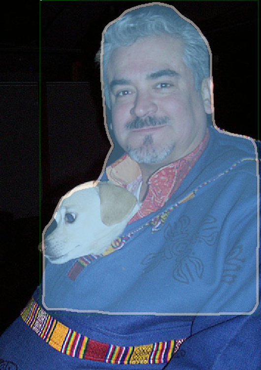
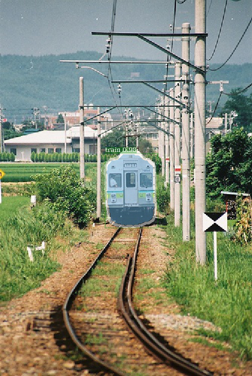
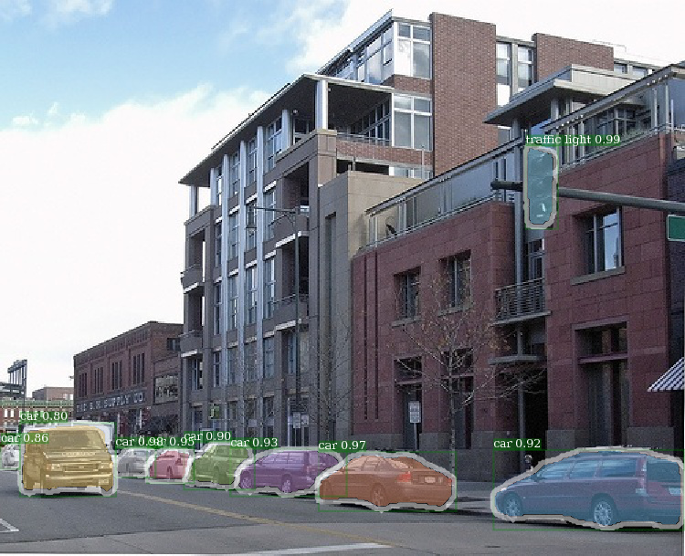
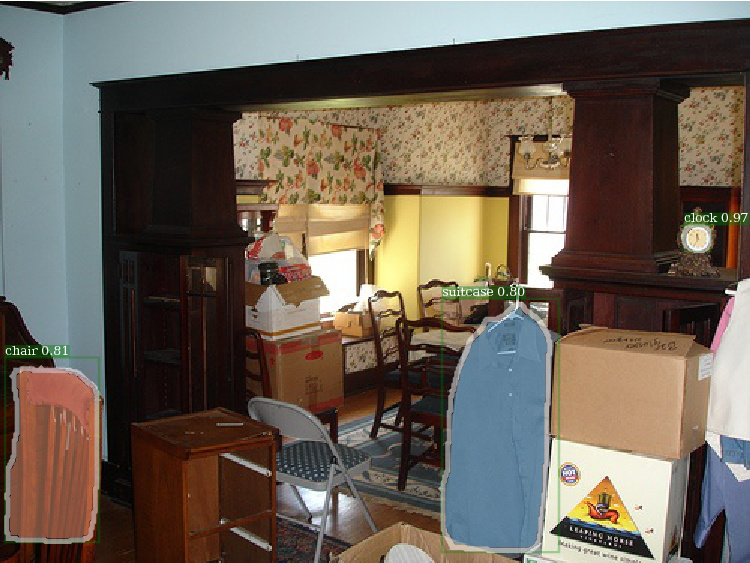

# A Pytorch Implementation of Detectron

<div align="center">


<p> Example output of *e2e_mask_rcnn-R-101-FPN_2x* using Detectron pretrained weight.</p>


<p>Corresponding example output from Detectron. </p>


<p>Example output of *e2e_keypoint_rcnn-R-50-FPN_s1x* using Detectron pretrained weight.</p>

</div>

**This code follows the implementation architecture of Detectron.** Only part of the functionality is supported. Check [this section](#supported-network-modules) for more information.

With this code, you can...

1. **Train your model from scratch.**
2. **Inference using the pretrained weight file (*.pkl) from Detectron.**

This repository is originally built on [jwyang/faster-rcnn.pytorch](https://github.com/jwyang/faster-rcnn.pytorch). However, after many modifications, the structure changes a lot and it's now more similar to [Detectron](https://github.com/facebookresearch/Detectron). I deliberately make everything similar or identical to Detectron's implementation, so as to reproduce the result directly from official pretrained weight files.

This implementation has the following features:

- **It is pure Pytorch code**. Of course, there are some CUDA code.

- **It supports multi-image batch training**.

- **It supports multiple GPUs training**.

- **It supports three pooling methods**. Notice that only **roi align** is revised to match the implementation in Caffe2. So, use it.

- **It is memory efficient**. For data batching, there are two techiniques available to reduce memory usage: 1) *Aspect grouping*: group images with similar aspect ratio in a batch 2) *Aspect cropping*: crop images that are too long. Aspect grouping is implemented in Detectron, so it's used for default. Aspect cropping is the idea from [jwyang/faster-rcnn.pytorch](https://github.com/jwyang/faster-rcnn.pytorch), and it's not used for default. 

  Besides of that, I implement a customized `nn.DataParallel ` module which enables different batch blob size on different gpus. Check [My nn.DataParallel](#my-nndataparallel) section for more details about this.

## Supported Network modules

- Backbone architecture: 

  - ResNet series: `ResNet50_conv4_body`, `ResNet50_conv5_body`, `ResNet101_Conv4_Body`, `ResNet101_Conv5_Body`, `ResNet152_Conv5_Body`
  - FPN: `fpn_ResNet50_conv5_body`,  `fpn_ResNet50_conv5_P2only_body`, `fpn_ResNet101_conv5_body`,  `fpn_ResNet101_conv5_P2only_body`,  `fpn_ResNet152_conv5_body`,  `fpn_ResNet152_conv5_P2only_body`

  ResNeXt are also implemented but not yet tested.

- Box head: `ResNet_roi_conv5_head`, `roi_2mlp_head`

- Mask head: `mask_rcnn_fcn_head_v0upshare`, `mask_rcnn_fcn_head_v0up`, `mask_rcnn_fcn_head_v1up4convs`, `mask_rcnn_fcn_head_v1up`

- Keypoints head: `roi_pose_head_v1convX`

**NOTE**: the naming is similar to the one used in Detectron. Just remove the prepending `add_` if it any.

## Supported Datasets

Only COCO is supported for now. However, the whole dataset library implementation is almost identical to Detectron's, so it should be easy to add more datasets supported by Detectron.

## Configuration Options

Architecture specific configuration files are put under [configs](configs/). The general configuration file [lib/core/config.py](lib/core/config.py) **has almost all the options with same default values as in Detectron's**, so it's effortless to transform the architecture specific configs from Detectron. 

### How to transform configuration files from Detectron

1. Remove `MODEL.NUM_CLASSES`. It will be set during the initialization of JsonDataset.
2. Remove `TRAIN.WEIGHTS`, `TRAIN.DATASETS` and `TEST.DATASETS`
3. For module type options (e.g `MODEL.CONV_BODY`, `FAST_RCNN.ROI_BOX_HEAD` ...), remove `add_` in the string if exists.
4. If want to load ImageNet pretrained weights for the model, add `RESNETS.IMAGENET_PRETRAINED_WEIGHTS` pointing to the pretrained weight file. If not, set `MODEL.LOAD_IMAGENET_PRETRAINED_WEIGHTS` to `False`.
5. Do **NOT** change the option `NUM_GPUS` in the config file. It's used to infer the original batch size for training, and learning rate will be linearly scaled according to batch size change. Proper learning rate adjustment is important for training with different batch size.

### Some more details

**Some options are not used** because the corresponding functionalities are not implemented yet. While, some are not use because I implement the program in different way.

Here are some options that have no effects and worth noticing:

 - `SOLVER.LR_POLICY`, `SOLVER.MAX_ITER`, `SOLVER.STEPS`,`SOLVER.LRS`: For now, the training policy is controlled by these command line arguments: 

    - **`--epochs`**: How many epochs to train. One epoch means one travel through the whole training sets. Defaults to  6.
    - **`--lr_decay_epochs `**: Epochs to decay the learning rate on. Decay happens on the beginning of a epoch. Epoch is 0-indexed. Defaults to [4, 5].

   For more command lie arguments, please refer to `python train_net.py --help`

- `SOLVER.WARM_UP_ITERS`, `SOLVER.WARM_UP_FACTOR`, `SOLVER.WARM_UP_METHOD`: Training warm up in the paper [Accurate, Large Minibatch SGD: Training ImageNet in 1 Hour](https://arxiv.org/abs/1706.02677) is not implemented.

- `OUTPUT_DIR`: Use the command line argument **`--output_base_dir`** to specify the output directory instead.

**While some more options are provided**:

- `MODEL.LOAD_IMAGENET_PRETRAINED_WEIGHTS = True`:  Whether to load ImageNet pretrained weights.
  - `RESNETS.IMAGENET_PRETRAINED_WEIGHTS = ''`: Path to pretrained residual network weights. If start with `'/'`, then it is treated as a absolute path. Otherwise, treat as a relative path to `ROOT_DIR`.
- `TRAIN.ASPECT_CROPPING = False`, `TRAIN.ASPECT_HI = 2`, `TRAIN.ASPECT_LO = 0.5`: Options for aspect cropping to restrict image aspect ratio range.
- `RPN.OUT_DIM_AS_IN_DIM = True`, `RPN.OUT_DIM = 512`, `RPN.CLS_ACTIVATION = 'sigmoid'`: Official implement of RPN has same input and output feature channels and use sigmoid as the activation function for fg/bg class prediction. In [jwyang's implementation](https://github.com/jwyang/faster-rcnn.pytorch/blob/master/lib/model/rpn/rpn.py#L28), it fix output channel number to 512 and use softmax as activation function.

## My nn.DataParallel

TBA

## Getting Started
Clone the repo:

```bash
git clone https://github.com/roytseng-tw/mask-rcnn.pytorch.git
```

### Requirements

Tested under python3.

- python packages
  - pytorch==0.3.1  (cuda80, cudnn7.1.2)
  - torchvision==0.2.0  
  - numpy  
  - scipy  
  - opencv
  - pyyaml
  - [pycocotools](https://github.com/cocodataset/cocoapi)  — for COCO dataset, also available from pip.
  - tensorboardX  — for logging the losses in Tensorboard
- An NVIDAI GPU and CUDA 8.0 or higher. Some operations only have gpu implementation.
- **NOTICE**: different versions of Pytorch package have different memory usages.

### Compilation

Compile the CUDA code:

```bash
cd lib  # please change to this directory
sh make.sh
```

If your are using Volta GPUs, uncomment this [line](https://github.com/roytseng-tw/mask-rcnn.pytorch/tree/master/lib/make.sh#L15) in `lib/mask.sh` and remember to postpend a backslash at the line above. `CUDA_PATH` defaults to `/usr/loca/cuda`. If you want to use a CUDA library on different path, change this [line](https://github.com/roytseng-tw/mask-rcnn.pytorch/tree/master/lib/make.sh#L3) accordingly.

It will compile all the modules you need, including NMS, ROI_Pooing, ROI_Crop and ROI_Align. (Actually gpu nms is never used ...)

Note that, If you use `CUDA_VISIBLE_DEVICES` to set gpus, **make sure at least one gpu is visible when compile the code.**

### Data Preparation

Create a data folder under the repo,

```bash
cd {repo_root}
mkdir data
```

- **COCO**: 
  Download the coco images and annotations from [coco website](http://cocodataset.org/#download).

  And make sure to put the files as the following structure:
  ```
  coco
  ├── annotations
  |   ├── instances_minival2014.json
  │   ├── instances_train2014.json
  │   ├── instances_train2017.json
  │   ├── instances_val2014.json
  │   ├── instances_val2017.json
  │   ├── instances_valminusminival2014.json
  │   ├── person_keypoints_train2014.json
  │   ├── person_keypoints_train2017.json
  │   ├── person_keypoints_val2014.json
  │   └── person_keypoints_val2017.json
  └── images
      ├── train2014
      ├── train2017
      ├── val2014
      └── val2017
  ```
  Download link for [instances_minival2014.json](https://dl.dropboxusercontent.com/s/o43o90bna78omob/instances_minival2014.json.zip?dl=0) and [instances_valminusminival2014.json](https://dl.dropboxusercontent.com/s/s3tw5zcg7395368/instances_valminusminival2014.json.zip?dl=0)

   Feel free to put the dataset at any place you want, and then soft link the dataset under the `data/` folder:

   ```bash
   ln -s path/to/coco data/coco
   ```

  Recommend to put the images on a SSD for possible better training performance

  In my experience, COCO2014 has some mask annotations that have different (h,w) shape to the corresponding images. Maybe `instances_minival2014.json` and `instances_valminusminival2014.json` contains corrupted mask annotations.  However, COCO2017 doesn't have this issue. It is said that COCO train2017 equals to (COCO train 2014 + COCO minival 2014) and COCO test 2017 equals to COCO valminusminival 2014. Hence, it should be fine to use COCO 2017 train-val splits to reproduce the results.

### Pretrained Model

I use ImageNet pretrained weights from Caffe for the backbone networks.

- [ResNet50](https://drive.google.com/open?id=1wHSvusQ1CiEMc5Nx5R8adqoHQjIDWXl1), [ResNet101](https://drive.google.com/open?id=1x2fTMqLrn63EMW0VuK4GEa2eQKzvJ_7l), [ResNet152](https://drive.google.com/open?id=1NSCycOb7pU0KzluH326zmyMFUU55JslF)
- [VGG16](https://drive.google.com/open?id=19UphT53C0Ua9JAtICnw84PPTa3sZZ_9k)  (vgg backbone is not implemented yet)

Download them and put them into the `{repo_root}/data/pretrained_model`.

You can the following command to download them all: 

​	- extra required packages: `argparse_color_formater`, `colorama`

```bash
python tools/download_imagenet_weights.py
```

**NOTE**: Caffe pretrained weights have slightly better performance than Pytorch pretrained. Suggest to use Caffe pretrained models from the above link to reproduce the results. By the way, Detectron also use pretrained weights from Caffe. 

**If you want to use pytorch pre-trained models, please remember to transpose images from BGR to RGB, and also use the same data preprocessing (minus mean and normalize) as used in Pytorch pretrained model.**

## Train

- Train mask-rcnn with res50 backbone from scratch

  ````bash
  python tools/train_net.py --dataset coco2017 --cfg configs/e2e_mask_rcnn_R-50-C4.yml --use_tfboard --bs {batch_size} --nw {num_workers}
  ````

  Use `--bs` to overwrite the default batch size (e.g. 8) to a proper value that fits into your GPUs. Simliar for `--nw`, number of data loader threads defaults to 4 in config.py.

  Specify `—use_tfboard` to log the losses on the Tensorboard.

- Resume training with exactly same settings from the end of an epoch

  ```bash
  python tools/train_net.py --dataset coco2017 --cfg configs/e2e_mask_rcnn_R-50-C4.yml --resume --load_ckpt {path/to/the/checkpoint} --bs {batch_size}
  ```

  **The difference of w/ and w/o `--resume`**: Optimizer state will be loaded from the checkpoint file if  `--resume` is specified. Otherwise, not.

- Train keypoint-rcnn

  ```bash
  python tools/train_net.py --dataset keypoints_coco2017 ...
  ```

- Fine tune from the Detectron pretrained weights

  ```bash
  python train_net.py --dataset coco2017 --cfg cfgs/e2e_mask_rcnn_R-50-C4.yml --load_detectron {path/to/detectron/weight} --bs {batch_size}
  ```

  **NOTE**: optimizer state (momentums for SGD) are not loaded. (To be implemented)

## Inference

```bash
python tools/infer_simple.py --dataset coco --cfg cfgs/e2e_mask_rcnn_R-50-C4.yml --load_detectron {path/to/detectron/weight} --image_dir {dir/of/input/images}  --output_dir {dir/to/save/visualizations}
```

 `--output_dir` defaults to `infer_outputs`.

## Benchmark

### keypoint_rcnn
- e2e_keypoint_rcnn_R-50-FPN
  - Training command: `python tools/train_net.py --dataset keypoints_coco2017 --cfg configs/e2e_keypoint_rcnn_R-50-FPN.yaml --bs 8`  
    Trained for 6 epochs with batch size 8, and decay the lr by 0.1 on the start of 5th and 6th epoch. There are floor(113198 / 8) = 14149 iterations per epoch.
  
    Dataset: keypoints_coco_2017_val  
    Task: box

    | AP            | AP50   | AP75   | APs    | APm    | APl    |
    |---------------|--------|--------|--------|--------|--------|
    | 0.5201 (0.536)| 0.8169 | 0.5638 | 0.3494 | 0.5995 | 0.6812 |
    
    Task: keypoint
    
    | AP            | AP50   | AP75   | APm    | APl    |
    |---------------|--------|--------|--------|--------|
    | 0.6204 (0.642)| 0.8523 | 0.6730 |0.5700  | 0.7028 |
    
  - The values in parentheses are **AP** of Detectron's `e2e_keypoint_rcnn_R-50-FPN_1x`, which is trained for 90000 iterations with batch size 16, and decay the lr by 0.1 after 60000th and 80000th iteration.


## Visualization

- Train *e2e_mask_rcnn_R-50_C4* from scratch for 1 epoch on coco_train_2017 with batch size 4:

  
  
  
  

